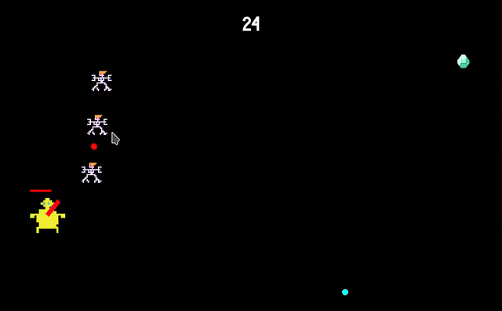

# Supercell Coding Test

This was Supercell coding test. There was given basic game built with SFML library and it had bugs.

Idea of the project was to fix the bugs and add own features to the game to make it more playable and fun.



## Building and running

Simply run

``` Bash
cmake -B build
cmake --build build
./build/bin/survive
```
This builds the executable in `./build/bin/`.

The exact location of the executable may differ depending on your system and compiler. Example locations are `./build/bin/survive` and `./build/bin/Debug/survive.exe`.

## Controls

`WASD` to move \
`Mouse` to aim and `mouse1` shoot

## Prerequisites

You must have [CMake](https://cmake.org/) version 3.22.1 or later installed to build this project.

If you are on Linux, make sure to install SFML's dependencies. For Debian-based distros:
```
sudo apt update
sudo apt install \
    libxrandr-dev \
    libxcursor-dev \
    libudev-dev \
    libfreetype-dev \
    libopenal-dev \
    libflac-dev \
    libvorbis-dev \
    libgl1-mesa-dev \
    libegl1-mesa-dev
```

## My contribution

Player healthbar \
All projectiles \
Weapon to shoot projectiles \
Collectables that can be shot as shotgun projectiles
